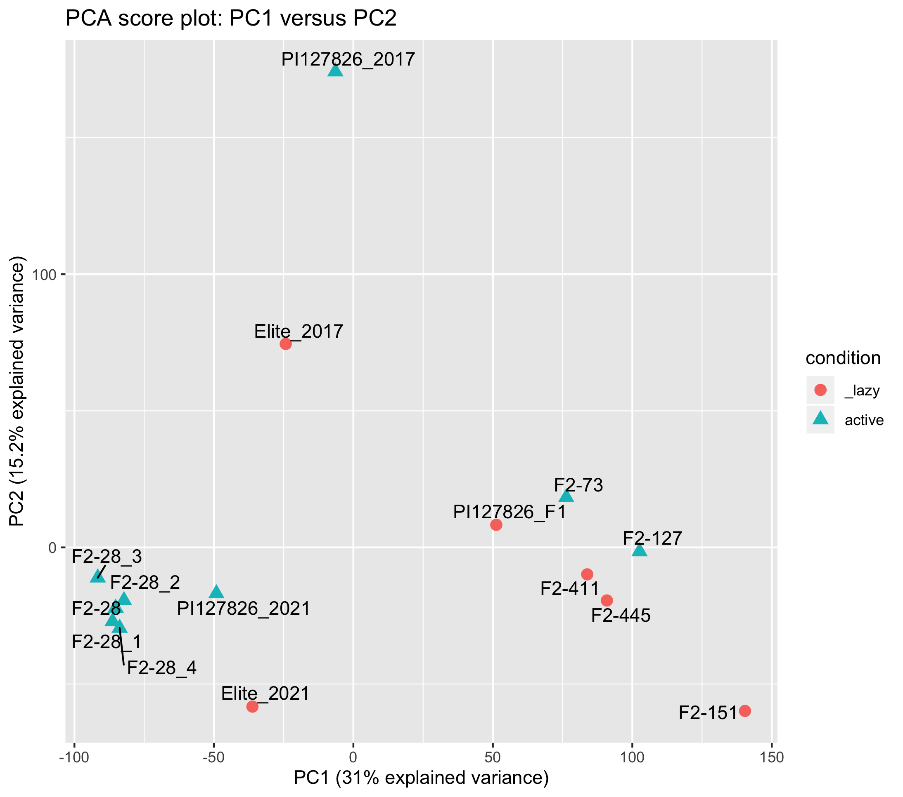
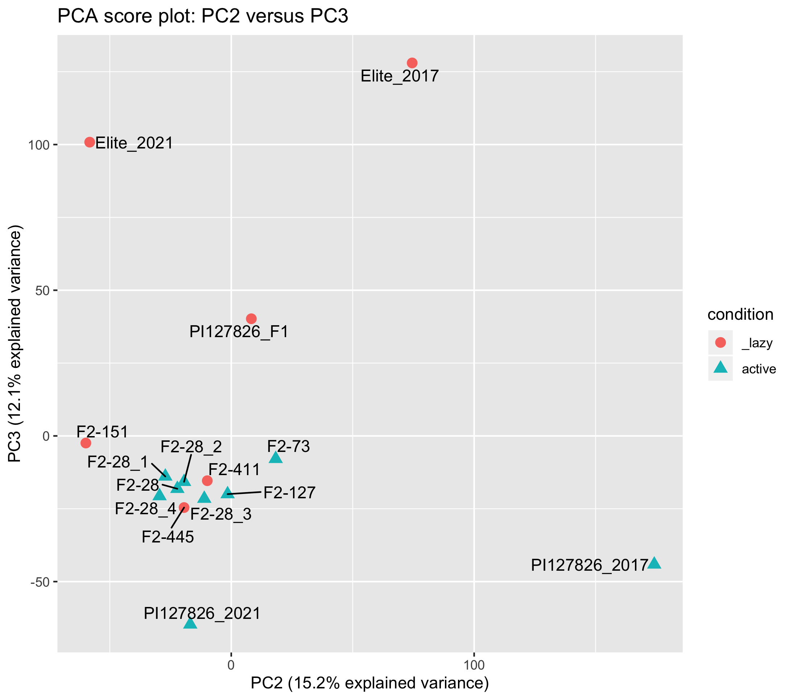

# Differential expression analysis of active and lazy genotypes

The description of the fastq mRNA-seq to Kallisto pseudoalignments is described in the [`Supplemental_data_RNA-seq/` folder.](../Supplemental_data_RNA-seq/)  

The complete Kallisto/Sleuth analysis can be found in the [`kallisto_sleuth_analysis.RData` R object.](./kallisto_sleuth_analysis.RData)

# Table of differential genes

| gene               	| pval     	| qval       	| log2foldChange 	| se_log2foldChange 	| annotation                                                                                       	|
|--------------------	|----------	|------------	|----------------	|-------------------	|--------------------------------------------------------------------------------------------------	|
| Solyc04g018080.4.1 	| 1.76E-13 	| 3.97E-09   	| -5.7317487     	| 0.77813078        	| mediator of RNA polymerase II transcription subunit 15a (AHRD V3.3 --*   XP_010319382.1)         	|
| Solyc04g024420.3.1 	| 7.42E-09 	| 8.38E-05   	| -5.3815739     	| 0.93087936        	| Proteasome subunit beta (AHRD V3.3 *** A0A2G2VMP0_CAPBA)                                         	|
| Solyc04g078740.2.1 	| 1.95E-08 	| 0.00014685 	| 1.48390181     	| 0.26421284        	| Subtilisin-like protease-like protein (AHRD V3.3 *** A0A2K3MUK4_TRIPR)                           	|
| Solyc04g050180.3.1 	| 2.80E-08 	| 0.00015821 	| -4.5285645     	| 0.81546431        	| Unknown protein                                                                                  	|
| Solyc04g018085.1.1 	| 8.73E-08 	| 0.00033831 	| -4.5033838     	| 0.84154085        	| Unknown protein                                                                                  	|
| Solyc10g007300.2.1 	| 1.49E-07 	| 0.00048098 	| -4.4746443     	| 0.85171606        	| Unknown protein                                                                                  	|
| Solyc04g018090.2.1 	| 2.54E-06 	| 0.0057273  	| -4.208751      	| 0.89448834        	| Sodium/hydrogen exchanger                                                                        	|
| Solyc04g057840.1.1 	| 3.55E-06 	| 0.00729023 	| -3.8636526     	| 0.83339022        	| Pvr4 (AHRD V3.3 *-* A0A1D5AHY8_CAPAN)                                                            	|
| Solyc06g071250.4.1 	| 6.05E-06 	| 0.01138486 	| -1.9910018     	| 0.44003461        	| hypothetical protein (AHRD V3.3 *-* AT1G19010.1)                                                 	|
| Solyc03g122330.1.1 	| 8.61E-06 	| 0.01388667 	| -3.8266339     	| 0.860023          	| Unknown protein                                                                                  	|
| Solyc04g025450.3.1 	| 8.13E-06 	| 0.01388667 	| -3.8270362     	| 0.85775488        	| Acetate/butyrate--CoA ligase AAE7                                                                	|
| Solyc06g065260.3.1 	| 1.15E-05 	| 0.01732531 	| -1.0189476     	| 0.23228054        	| Receptor-like protein kinase (AHRD V3.3 *** A0A2R6RP54_ACTCH)                                    	|
| Solyc01g006050.2.1 	| 1.40E-05 	| 0.01761568 	| -1.2853048     	| 0.29593341        	| transmembrane protein 45B-like (AHRD V3.3 *** A0A2I4DQK0_9ROSI)                                  	|
| Solyc04g057860.3.1 	| 1.38E-05 	| 0.01761568 	| -3.9928943     	| 0.91855478        	| 60S ribosomal protein L27 (AHRD V3.3 *** A0A1U8H3W7_CAPAN)                                       	|
| Solyc04g150132.1.1 	| 1.58E-05 	| 0.01784726 	| -3.7128856     	| 0.86010244        	| Unknown protein                                                                                  	|
| Solyc04g053130.4.1 	| 1.54E-05 	| 0.01784726 	| -1.6247555     	| 0.37587782        	| Stress enhanced protein 2                                                                        	|
| Solyc04g055160.3.1 	| 2.01E-05 	| 0.02028458 	| 0.98351065     	| 0.23069513        	| Alpha-ketoglutarate-dependent dioxygenase alkB-like protein 2 (AHRD V3.3   *** A0A2G2X511_CAPBA) 	|
| Solyc12g005820.3.1 	| 2.07E-05 	| 0.02028458 	| 1.31863096     	| 0.30970898        	| transmembrane protein (AHRD V3.3 *** AT3G21710.2)                                                	|
| Solyc04g051240.1.1 	| 3.33E-05 	| 0.03057214 	| -3.770899      	| 0.90875429        	| Unknown protein                                                                                  	|
| Solyc04g072607.1.1 	| 3.71E-05 	| 0.0322157  	| -3.3764302     	| 0.81854914        	| Unknown protein                                                                                  	|
| Solyc07g064910.3.1 	| 4.75E-05 	| 0.03803608 	| 0.95539833     	| 0.2348782         	| EH domain-containing protein.1                                                                   	|

[Complete table available here](./sleuth_differential_genes.csv)
 
# PCA analysis

## Sample score plots

