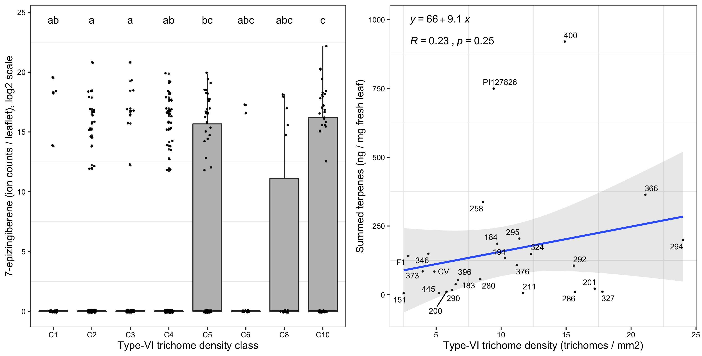

# Figure 3

## Figure 3 legend
Some legend here  
(A) Trichome density classes versus 7-epiziginberene level (log2 scale). Genotypes without any level of 7-epizingiberene were removed before a Tukey honest significant difference test was performed to assess statistically different means (p < 0.05, same letters indicate non-significant differences). The number of measurement per class is indicated above each trichome density class boxplot.
(B)  Pearson correlation coefficient, its related p-value and the simple linear regression equation are indicated on the top left. 

## Figure preview 

