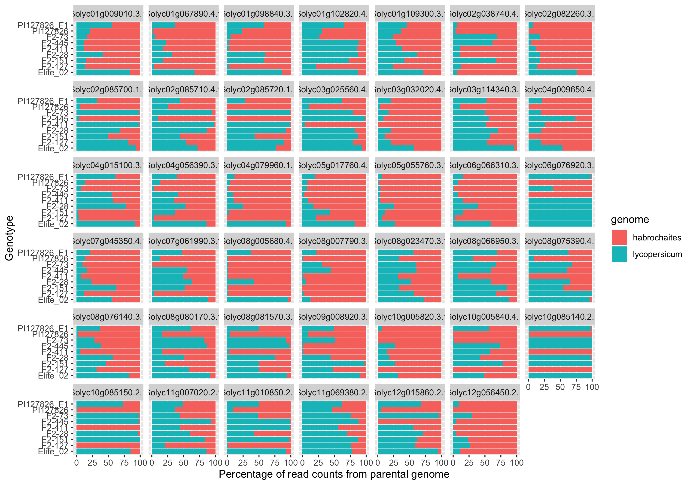

# Allele-specific expression

# Data provenance

## Derived data: count tables
The `counts_on_heinz.tsv` and the `counts_on_habrochaites.tsv` are derived from 
mRNA-seq fastq files (see "mRNA-seq fastq files" below) using a dedicated pipeline
(see "Software" section below). 
These files contain raw counts and are based on either _S. lycopersicum_ Heinz1706 genome or
_S. habrochaites_ PI127826 genome.

## Raw data: mRNA-seq fastq files

mRNA-seq fastq files archives:
* _S. lycopersicum_ and _S. habrochaites_ parental lines and F1s: [Link to Zenodo archive](https://zenodo.org/record/3610267).  
* Selected F2 "active" and "lazy" lines from a cross between _S. lycopersicum_ Elite x _S. habrochaites_ PI127826: [Link to Zenodo archive](https://zenodo.org/record/3610279).

## Software
A pipeline to go from RNA-seq fastq files to counts was used and can be found on [GitHub](https://github.com/BleekerLab/snakemake_rnaseq_to_counts/releases/tag/v0.2.2).

## PI12826 genome and annotation 

The genome of PI127826 (`PI127826.final.fasta`) available on [Zenodo](https://zenodo.org/record/3712239) was annotated using [BLAT](https://genome.ucsc.edu/FAQ/FAQblat.html) which is a BLAST-like alignment tool optimized for genomes.

The `S. lycopersicum` mRNA targets of interest are listed in `targets.tsv` in this repository. It contains the genes to annotate and it was used to retrieve the PI127826 homologs and create the `PI127826_annotation.gtf` genome annotation.
