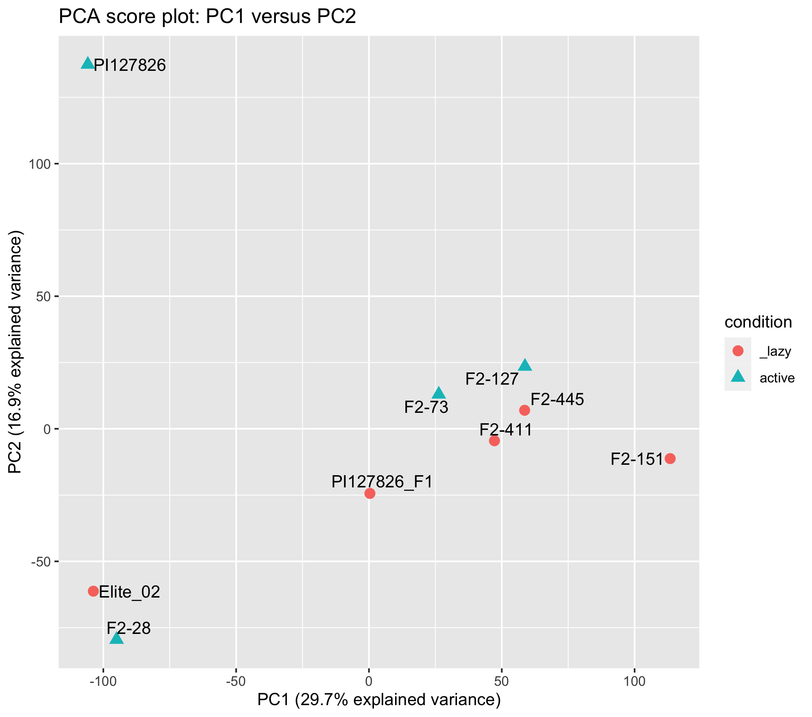
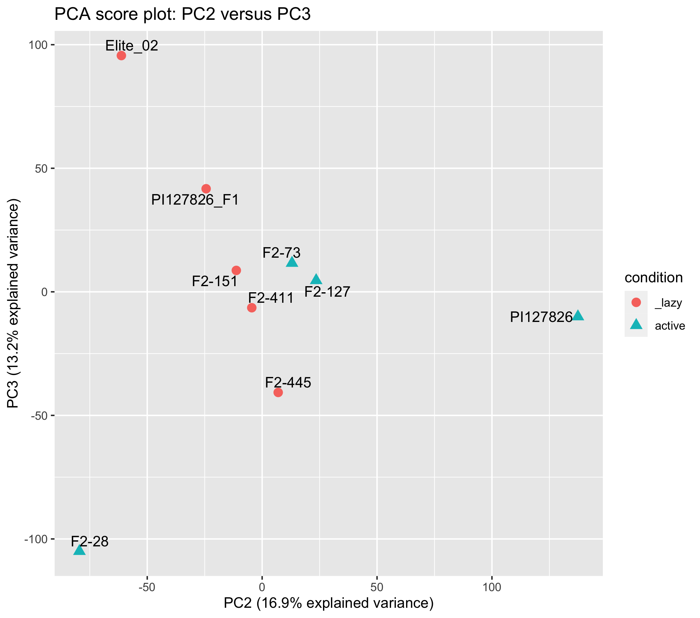

# Differential expression

The description of the fastq mRNA-seq to Kallisto pseudoalignments is described in the [`Supplemental_data_RNA-seq/` folder.](../Supplemental_data_RNA-seq/)  

The complete Kallisto/Sleuth analysis can be found in the [`kallisto_sleuth_analysis.RData` R object.](./kallisto_sleuth_analysis.RData)

# PCA analysis

## Sample score plots

