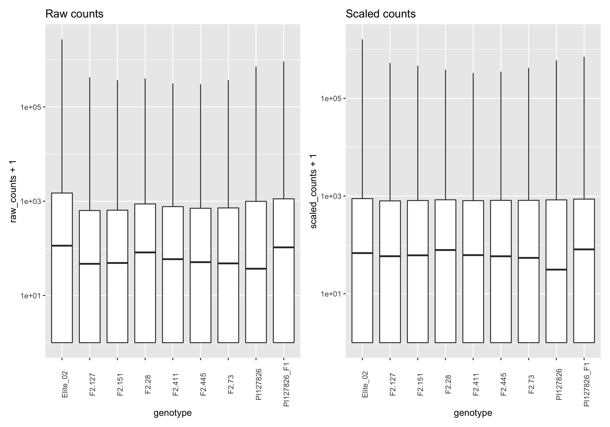
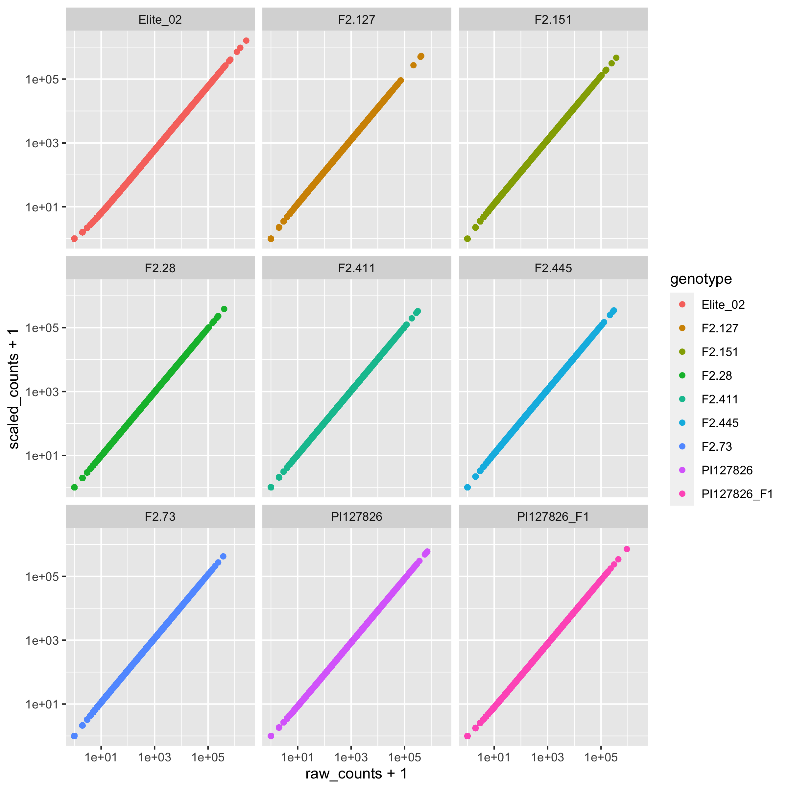

# RNA-seq analysis

This folder contains the `raw_counts.tsv` and the `scaled_counts.tsv` that are used for the differential expression analysis and other representations (PCA, heatmaps) for this paper. 

<!-- MarkdownTOC autolink="true" levels="1,2" -->

- [Reports from the analysis](#reports-from-the-analysis)
	- [FastQC metrics](#fastqc-metrics)
	- [Mapping report](#mapping-report)
- [Raw and scaled counts comparisons](#raw-and-scaled-counts-comparisons)
	- [Boxplots](#boxplots)
	- [Scatterplots](#scatterplots)
- [Code and data used](#code-and-data-used)
	- [Sequencing files](#sequencing-files)
	- [Software](#software)
	- [Genomic references](#genomic-references)

<!-- /MarkdownTOC -->

# Reports from the analysis

## FastQC metrics

## Mapping report

See [mapping summary table](./mapping_summary.tsv)

# Raw and scaled counts comparisons
To determine the effect of DESeq2 scaling procedure, two plots were made using the [`raw_versus_scaled_counts.R`](./raw_versus_scaled_counts.R) script.  
Results are plotted on a log10 axis (with an offset of 1 to avoid -Inf for gene counts equal to 0).

## Boxplots

## Scatterplots

# Code and data used

## Sequencing files
- F1, Elite line and S. habrochaites PI127826 mRNA-seq fastq files from stem trichomes: [link](https://doi.org/10.5281/zenodo.3603229) 
- F2 lines mRNA-seq fastq files from stem trichomes: [link](https://doi.org/10.5281/zenodo.3610278)

## Software 
Snakemake mRNA-seq pipeline: [link](https://zenodo.org/record/4034215)

## Genomic references
Tomato assembly and annotation SL4.0

